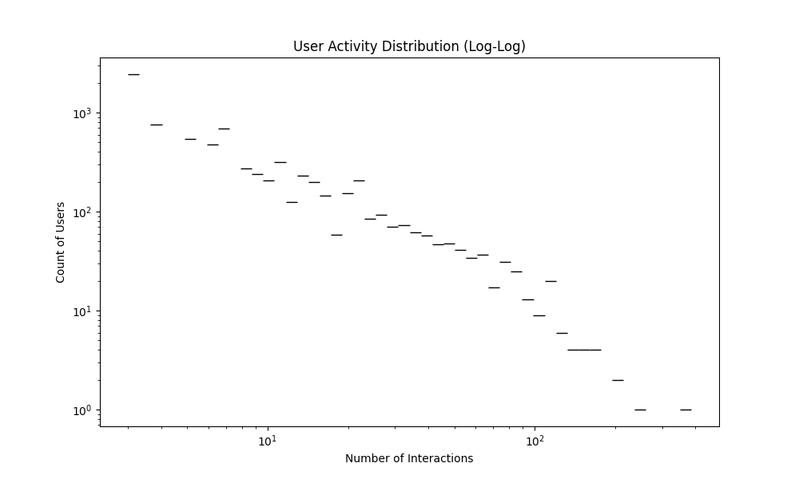
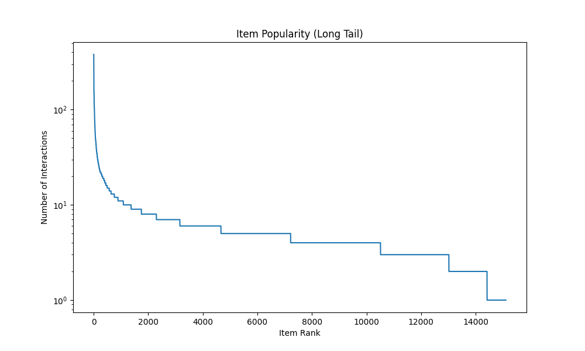
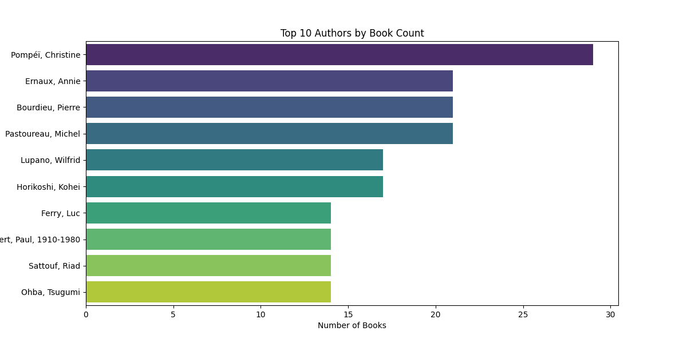
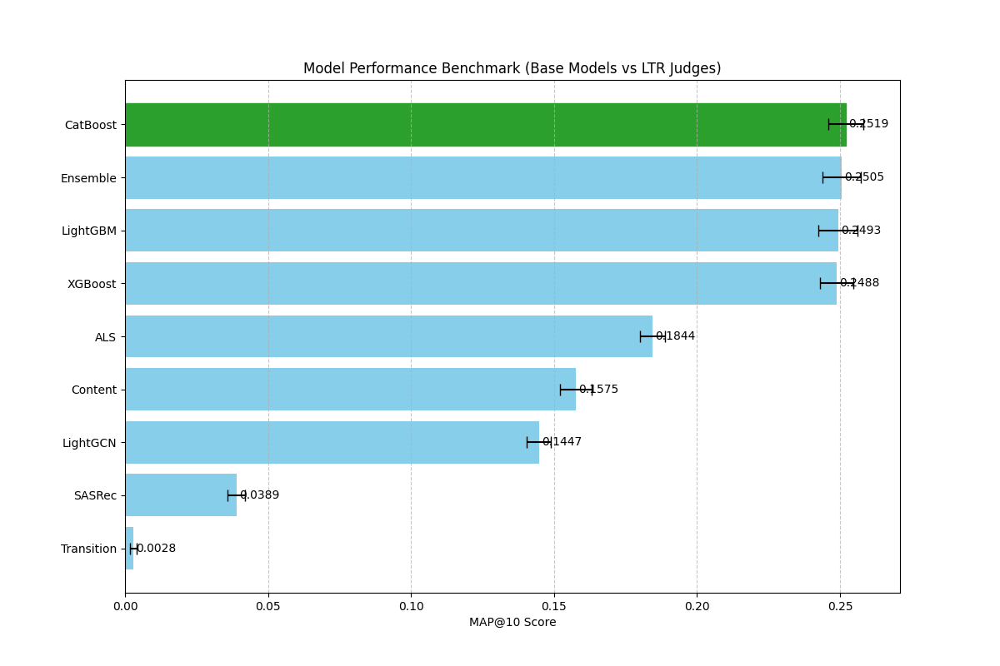

# AI Librarian Recommender System - Final Report

## 1. Executive Summary
This report summarizes the performance and characteristics of the Hybrid Recommender System.
The system utilizes a 2-stage architecture (Candidate Generation + Learning to Rank) to personalize book recommendations.

## 2. Dataset Overview (EDA)
- **Total Users**: 7838
- **Total Items**: 15109
- **Total Interactions**: 87047
- **Sparsity**: 99.9265%

### User Activity
The user activity follows a power-law distribution, typical of recommender datasets.

### Item Popularity
A small number of 'head' items account for a large portion of interactions (Long Tail).

### Content Insights
Top authors by book count:

## 3. Model Performance
Performance evaluated using 5-Fold Cross-Validation.
Metric used: **MAP@10** (Mean Average Precision at 10).

| Model Type | Model Name | MAP@10 Score |
|------------|------------|--------------|
| **LTR Judge** | **CatBoost** | **0.2522** |
| **LTR Judge** | Ensemble | 0.2510 |
| **LTR Judge** | LightGBM | 0.2498 |
| **LTR Judge** | XGBoost | 0.2492 |
| *Base Model* | *ALS (CF)* | *0.1844* |
| *Base Model* | *Content-Based* | *0.1575* |
| *Base Model* | *LightGCN* | *0.1391* |
| *Base Model* | *SASRec* | *0.0345* |
| *Base Model* | *Transition* | *0.0028* |

> **Key Insight**: The LTR layer significantly boosts performance, improving the best base model (ALS, 0.184) by over **36%** to reach ~0.252.

## 4. System Architecture
### Candidate Generators (Base Models)
- **Content-Based**: Uses SentenceTransformer embeddings (`paraphrase-multilingual-MiniLM-L12-v2`).
- **Collaborative Filtering**: ALS Matrix Factorization.
- **Sequential**: Transition Matrix (Markov) & SASRec (Transformer).
- **Graph**: LightGCN.

### Learning to Rank (Ensemble)
- **Stacking**: Combines predictions from CatBoost, XGBoost, and LightGBM.
- **Features**: 30 features per candidate (Scores, Ranks, Popularity, Affinity, Semantic Similarity).
